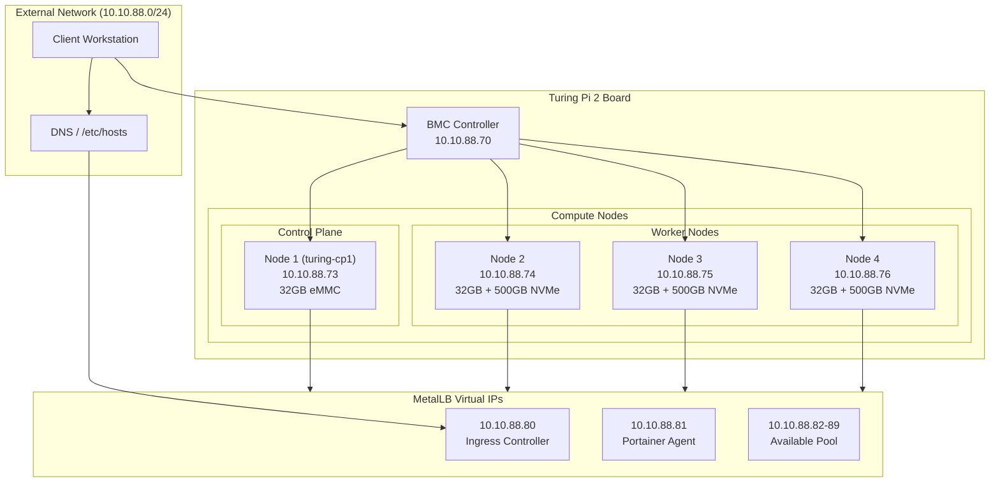
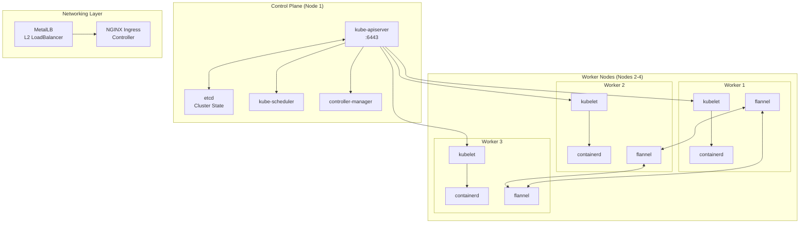
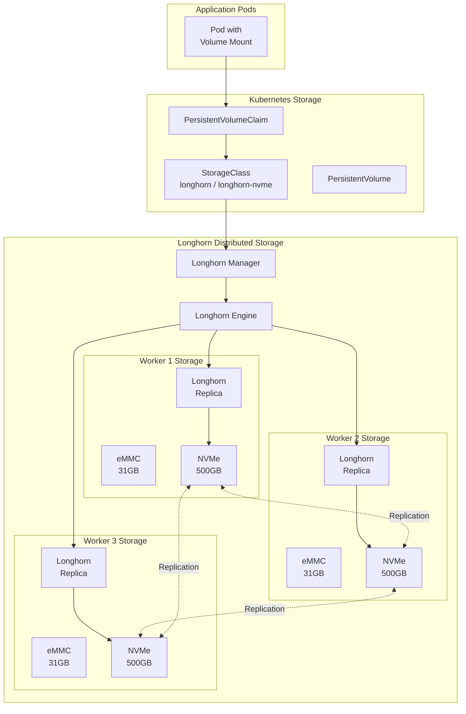
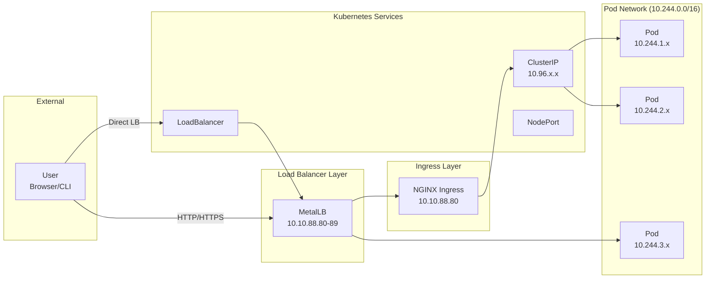
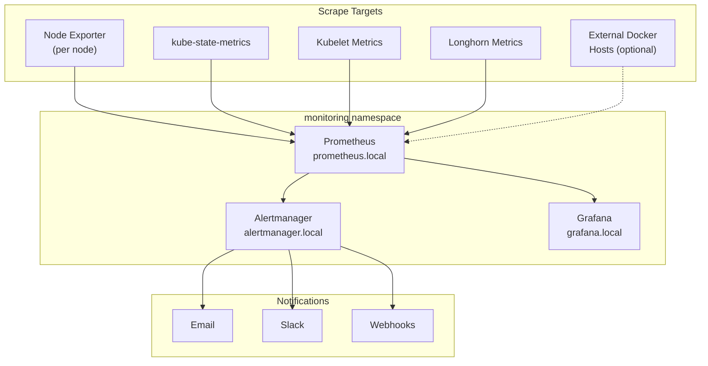
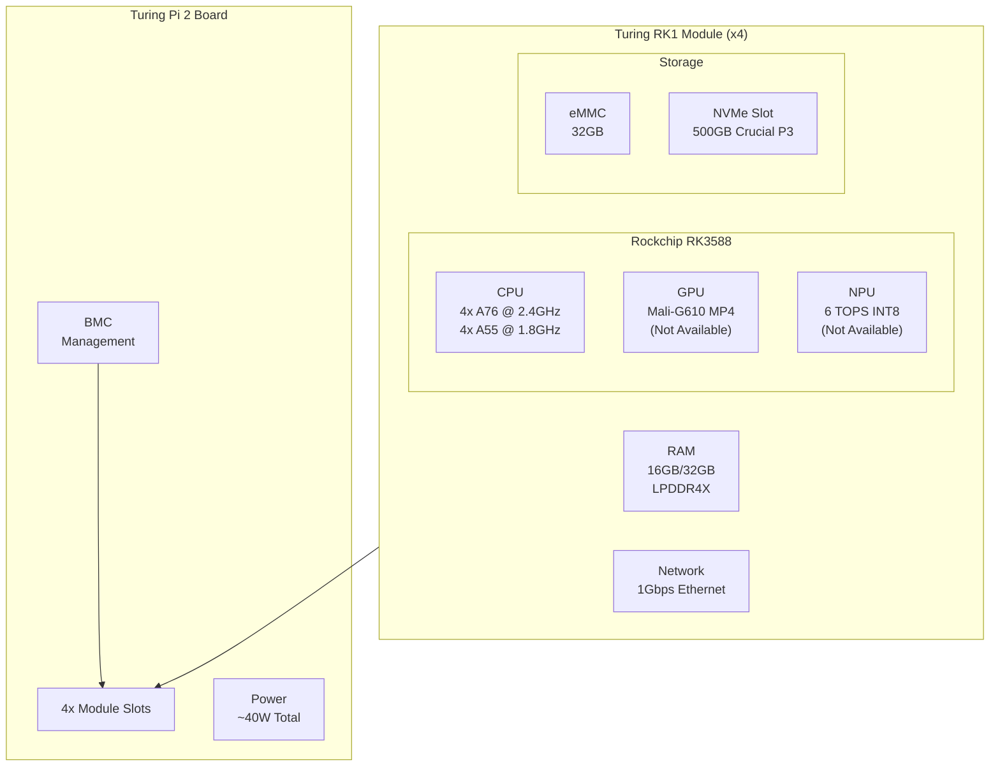
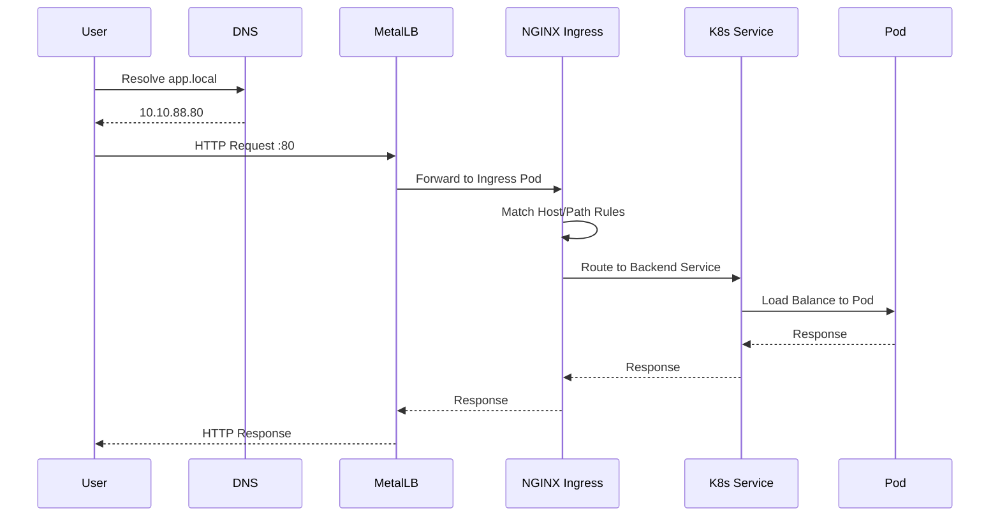
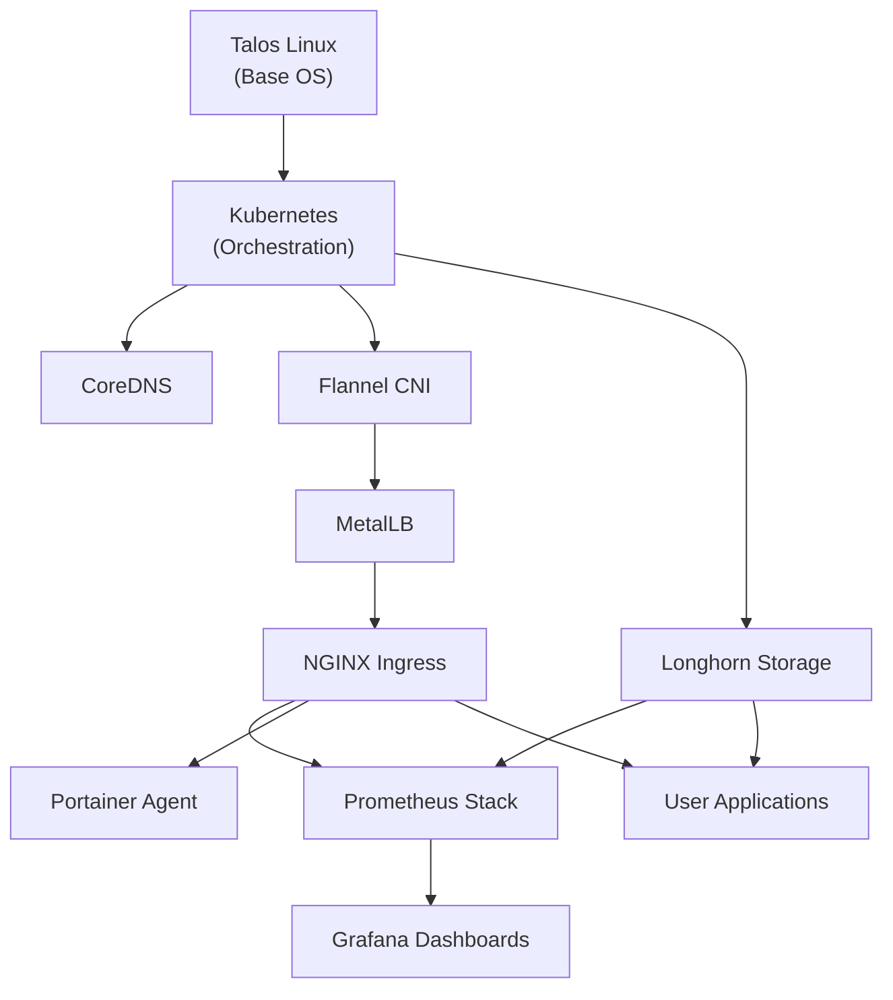

# Cluster Architecture

This document provides visual architecture diagrams for the Turing RK1 Kubernetes cluster.

## High-Level Overview



## Kubernetes Architecture



## Storage Architecture



## Network Traffic Flow



## Monitoring Stack



## Component Namespaces

```mermaid
flowchart TB
    subgraph kube-system["kube-system namespace"]
        CoreDNS["coredns"]
        KubeProxy["kube-proxy"]
        FlannelNS["flannel"]
    end

    subgraph metallb-system["metallb-system namespace"]
        MetalLBCtrl["metallb-controller"]
        MetalLBSpkr["metallb-speaker"]
    end

    subgraph ingress-nginx["ingress-nginx namespace"]
        IngressCtrl["ingress-nginx-controller"]
    end

    subgraph longhorn-system["longhorn-system namespace"]
        LonghornMgr["longhorn-manager"]
        LonghornUI["longhorn-ui"]
        LonghornDriver["longhorn-csi-driver"]
    end

    subgraph monitoring["monitoring namespace"]
        PromOp["prometheus-operator"]
        PromServer["prometheus-server"]
        GrafanaSvc["grafana"]
        AlertMgr["alertmanager"]
        NodeExporter["node-exporter"]
        KubeStateMetrics["kube-state-metrics"]
    end

    subgraph portainer["portainer namespace"]
        PortainerAgent["portainer-agent"]
    end

    subgraph default["default namespace"]
        UserApps["User Applications"]
    end
```

## Hardware Specifications



## IP Address Map

| Resource | IP Address | Port(s) | Purpose |
|----------|------------|---------|---------|
| BMC | 10.10.88.70 | 22, 80 | Board management |
| Control Plane | 10.10.88.73 | 6443, 50000 | K8s API, talosctl |
| Worker 1 | 10.10.88.74 | 50000 | talosctl |
| Worker 2 | 10.10.88.75 | 50000 | talosctl |
| Worker 3 | 10.10.88.76 | 50000 | talosctl |
| Ingress VIP | 10.10.88.80 | 80, 443 | HTTP/HTTPS traffic |
| Portainer VIP | 10.10.88.81 | 9001 | Portainer agent |
| Available | 10.10.88.82-89 | - | Future services |

## Network CIDRs

| Network | CIDR | Purpose |
|---------|------|---------|
| External | 10.10.88.0/24 | Physical network |
| Pod Network | 10.244.0.0/16 | Container IPs (Flannel) |
| Service Network | 10.96.0.0/12 | ClusterIP services |
| MetalLB Pool | 10.10.88.80-89 | LoadBalancer VIPs |

## Data Flow Example: Web Request



## Deployment Dependencies



## Rendering These Diagrams

These diagrams use [Mermaid](https://mermaid.js.org/) syntax and can be rendered:

1. **GitHub**: Automatically renders in README/docs
2. **VS Code**: Install "Markdown Preview Mermaid Support" extension
3. **CLI**: Use `mmdc` from mermaid-cli (`npm install -g @mermaid-js/mermaid-cli`)
4. **Online**: Paste into [Mermaid Live Editor](https://mermaid.live/)

To generate PNG/SVG images:

```bash
# Install mermaid-cli
npm install -g @mermaid-js/mermaid-cli

# Generate images
mmdc -i ARCHITECTURE.md -o architecture.png
```
